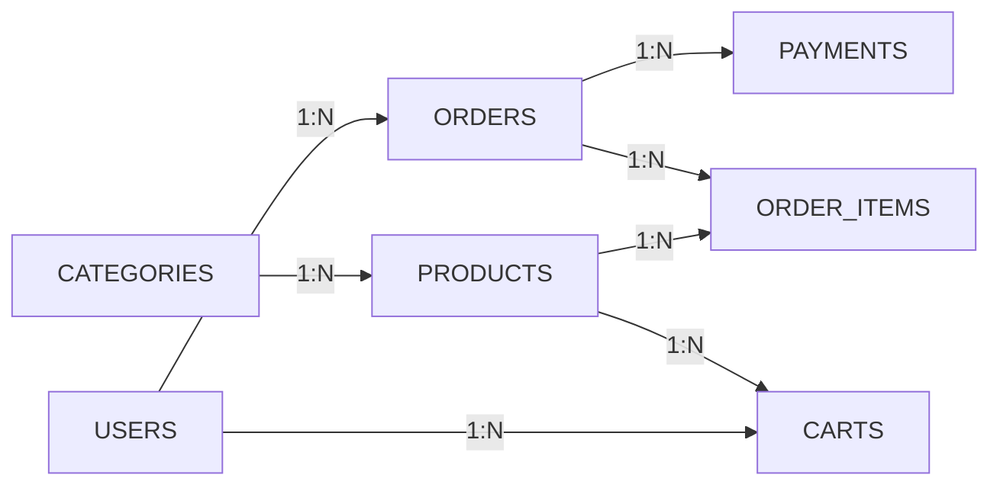

# ERD Documentation - FastFood Database Design

## 📊 Overview

Hệ thống FastFood sử dụng PostgreSQL database với 7 bảng chính để quản lý hoạt động đặt hàng đồ ăn nhanh online.

## 🏗️ Database Architecture

### Core Entities

#### 1. **USERS** - Quản lý người dùng

```sql
Primary Key: id (INT)
Unique Keys: username, email
```

- **Mục đích**: Lưu thông tin tài khoản khách hàng và quản trị viên
- **Đặc điểm**:
  - Hỗ trợ guest orders (user_id có thể null trong orders)
  - Role-based access (buyer, admin, staff)
  - Integrated với Supabase Auth

#### 2. **CATEGORIES** - Danh mục sản phẩm

```sql
Primary Key: id (SERIAL)
Unique Keys: name
```

- **Mục đích**: Phân loại sản phẩm (Burger, Chicken, Fries)
- **Đặc điểm**: Simple hierarchy, có thể mở rộng nested categories

#### 3. **PRODUCTS** - Catalog sản phẩm

```sql
Primary Key: id (INT)
Foreign Keys: category_id → categories.id
Unique Keys: slug
```

- **Mục đích**: Lưu thông tin chi tiết sản phẩm
- **Đặc điểm**:
  - SEO-friendly slugs
  - Image URLs (Supabase Storage)
  - Price history tracking (store in order_items)

### Transaction Entities

#### 4. **CARTS** - Giỏ hàng tạm thời

```sql
Primary Key: id (SERIAL)
Foreign Keys: user_id → users.id, product_id → products.id
Unique Constraint: (user_id, product_id)
```

- **Mục đích**: Lưu trữ tạm thời items trước khi checkout
- **Đặc điểm**:
  - Session-based storage
  - Auto-cleanup sau successful order
  - Sync với AsyncStorage/LocalStorage

#### 5. **ORDERS** - Đơn hàng chính

```sql
Primary Key: id (VARCHAR/UUID)
Foreign Keys: user_id → users.id (nullable)
```

- **Mục đích**: Quản lý lifecycle đơn hàng từ tạo đến hoàn thành
- **Đặc điểm**:
  - UUID để security và external API integration
  - Guest order support
  - Status tracking: pending → confirmed → processing → completed
  - Customer info embedded (không cần separate shipping table)

#### 6. **ORDER_ITEMS** - Chi tiết đơn hàng

```sql
Primary Key: id (SERIAL)
Foreign Keys: order_id → orders.id, product_id → products.id
```

- **Mục đích**: Line items của từng đơn hàng
- **Đặc điểm**:
  - Snapshot price tại thời điểm order (price history)
  - Quantity và special requests
  - Immutable sau khi order confirmed

#### 7. **PAYMENTS** - Lịch sử thanh toán

```sql
Primary Key: id (SERIAL)
Foreign Keys: order_id → orders.id
```

- **Mục đích**: Audit trail cho tất cả payment transactions
- **Đặc điểm**:
  - Multi-provider support (MoMo, VNPay, COD)
  - Full provider response storage (JSON)
  - Retry và refund tracking

## 🔗 Relationship Patterns

### One-to-Many Relationships



### Business Rules

1. **Cart Management**

   - User chỉ có 1 active cart
   - Cart items unique per (user_id, product_id)
   - Auto-clear cart sau successful order

2. **Order Processing**

   - Order ID sử dụng UUID cho security
   - Guest orders allowed (user_id = null)
   - Customer info stored in orders table
   - Price snapshot trong order_items

3. **Payment Flow**
   - Multiple payment attempts allowed per order
   - Full audit trail với provider responses
   - Status sync giữa orders và payments

## 📈 Scaling Considerations

### Current Schema Strengths

- ✅ Normalized design giảm data redundancy
- ✅ Foreign key constraints đảm bảo data integrity
- ✅ Indexes trên các query patterns phổ biến
- ✅ UUID orders cho external API security
- ✅ JSON storage cho flexible provider responses

### Future Enhancements

#### Recommended Additions

```sql
-- Inventory tracking
ALTER TABLE products ADD COLUMN stock_quantity INT DEFAULT 0;
ALTER TABLE products ADD COLUMN track_inventory BOOLEAN DEFAULT false;

-- Soft deletes
ALTER TABLE users ADD COLUMN deleted_at TIMESTAMP;
ALTER TABLE products ADD COLUMN deleted_at TIMESTAMP;

-- Order delivery tracking
CREATE TABLE deliveries (
    id SERIAL PRIMARY KEY,
    order_id VARCHAR(255) REFERENCES orders(id),
    driver_name VARCHAR(255),
    estimated_delivery TIMESTAMP,
    actual_delivery TIMESTAMP,
    delivery_notes TEXT
);

-- Promotions và discounts
CREATE TABLE promotions (
    id SERIAL PRIMARY KEY,
    code VARCHAR(50) UNIQUE,
    discount_type VARCHAR(20), -- percentage, fixed_amount
    discount_value DECIMAL(10,2),
    min_order_amount DECIMAL(12,2),
    valid_from TIMESTAMP,
    valid_until TIMESTAMP,
    max_uses INT
);
```

## 🔧 Database Operations

### Common Query Patterns

#### 1. Get User's Order History

```sql
SELECT o.*,
       COUNT(oi.id) as item_count,
       SUM(oi.quantity) as total_items
FROM orders o
LEFT JOIN order_item oi ON o.id = oi.order_id
WHERE o.user_id = $1
GROUP BY o.id
ORDER BY o.created_at DESC;
```

#### 2. Get Order Details with Items

```sql
SELECT o.*,
       oi.quantity,
       oi.price as unit_price,
       p.name as product_name,
       p.image as product_image
FROM orders o
JOIN order_item oi ON o.id = oi.order_id
JOIN products p ON oi.product_id = p.id
WHERE o.id = $1;
```

#### 3. Get Cart with Product Details

```sql
SELECT c.quantity,
       p.name,
       p.price,
       p.image,
       (c.quantity * p.price) as line_total
FROM carts c
JOIN products p ON c.product_id = p.id
WHERE c.user_id = $1;
```

#### 4. Payment Status Check

```sql
SELECT o.status as order_status,
       p.status as payment_status,
       p.payment_id,
       p.amount
FROM orders o
LEFT JOIN payments p ON o.id = p.order_id
WHERE o.id = $1
ORDER BY p.created_at DESC
LIMIT 1;
```

### Performance Optimizations

#### Indexes Strategy

```sql
-- Heavy read operations
CREATE INDEX idx_orders_user_status ON orders(user_id, status);
CREATE INDEX idx_products_category_price ON products(category_id, price);
CREATE INDEX idx_payments_order_status ON payments(order_id, status);

-- Time-based queries
CREATE INDEX idx_orders_created_date ON orders(DATE(created_at));
CREATE INDEX idx_payments_created_date ON payments(DATE(created_at));
```

#### Connection Pooling

- Supabase tự động handle connection pooling
- Recommended: 20-30 connections cho production
- Use read replicas cho heavy analytical queries

### Backup & Recovery

```sql
-- Daily backup strategy
pg_dump fastfood_db > backup_$(date +%Y%m%d).sql

-- Point-in-time recovery với WAL
-- Supabase provides automatic backups and PITR
```

## 🔒 Security Implementation

### Row Level Security (RLS)

```sql
-- Users chỉ access được data của mình
CREATE POLICY "own_data_only" ON orders
FOR ALL USING (auth.uid()::text = user_id::text);

-- Admin có full access
CREATE POLICY "admin_full_access" ON orders
FOR ALL USING (
  EXISTS(
    SELECT 1 FROM users
    WHERE id::text = auth.uid()::text
    AND role = 'admin'
  )
);
```

### Data Validation

- CHECK constraints cho business rules
- Foreign key constraints cho referential integrity
- NOT NULL cho required fields
- Unique constraints cho business keys

### Audit Trail

- Timestamps trên tất cả tables
- Full payment responses trong JSON
- Order status history tracking
- User session logging (optional)

## 📊 Analytics & Reporting

### Key Metrics Tables

```sql
-- Daily sales summary
CREATE MATERIALIZED VIEW daily_sales AS
SELECT DATE(created_at) as sale_date,
       COUNT(*) as order_count,
       SUM(total_amount) as total_revenue,
       AVG(total_amount) as avg_order_value
FROM orders
WHERE status = 'completed'
GROUP BY DATE(created_at);

-- Product popularity
CREATE MATERIALIZED VIEW product_stats AS
SELECT p.id,
       p.name,
       COUNT(oi.id) as times_ordered,
       SUM(oi.quantity) as total_quantity,
       SUM(oi.quantity * oi.price) as total_revenue
FROM products p
LEFT JOIN order_item oi ON p.id = oi.product_id
LEFT JOIN orders o ON oi.order_id = o.id
WHERE o.status = 'completed'
GROUP BY p.id, p.name;
```

Materialized views cần refresh định kỳ:

```sql
REFRESH MATERIALIZED VIEW daily_sales;
REFRESH MATERIALIZED VIEW product_stats;
```
